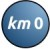
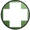

# Stage Map Icons

Tour de France stage map style icons in Scalable Vector Format for use in GIS applications.

A number of icons from Cross Country World Cup mountain bike events have also been added.

1. [Icons](#icons)
1. [Installation](#installation)  
  i. [QGIS 3.x](#qgis-3x)

## Icons

Icon | Name
--- | ---
 | Stage Start
 | Stage Finish
 | Kilometre 0
 | Feed Zone
 | Feed Zone - Water Only
... | Split Time
... | Sprint
... | Climb - Hors Category
... | Climb - Category 1
... | Climb - Category 2
... | Climb - Category 3
... | Climb - Category 4
... | Tech Zone
... | Photo Zone
 | Medical

## Installation

### QGIS 3.x
The correct location for user defined SVG symbols in QGIS 3.X has to be checked by opening `Settings | User Profiles | Open Active Profile Folder`.

If necessary, create an `svg` folder in this location. Then, QGIS will recognize it as the User's `svg` folder.

Copy the `Stage Map` folder from this repository to the `svg` folder.

Thanks to [@Kazuhito](https://gis.stackexchange.com/users/84455/kazuhito) on [StackOverflow](https://gis.stackexchange.com/questions/137855/importing-svg-symbols-into-qgis) for the guidance here.
